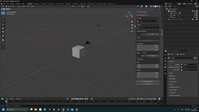
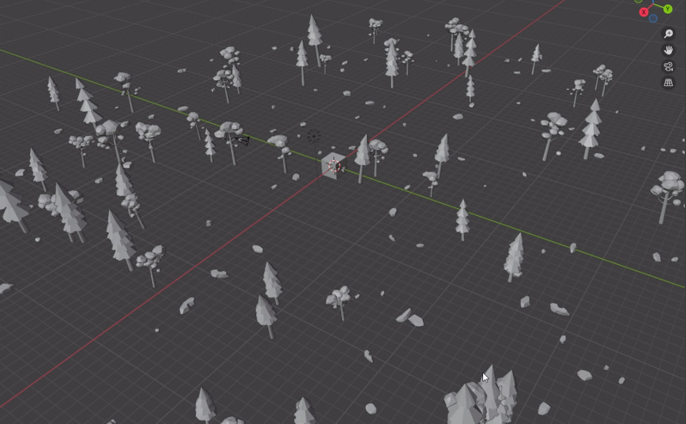
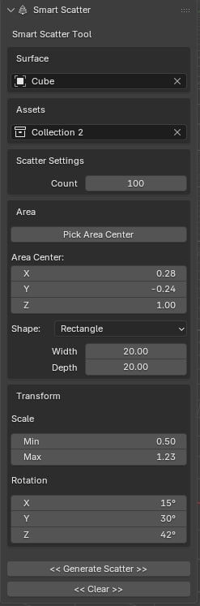
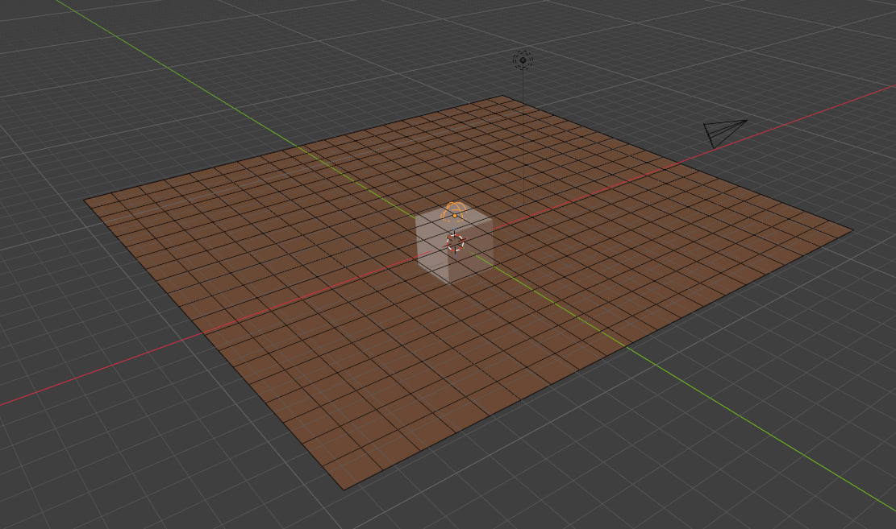
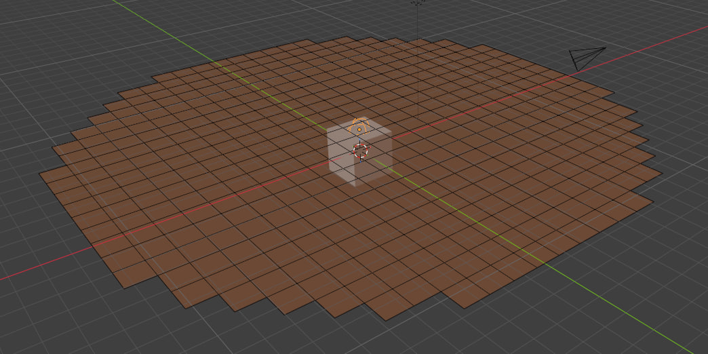
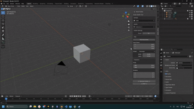
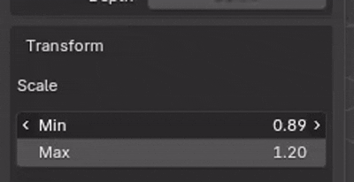
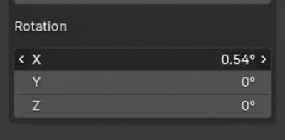
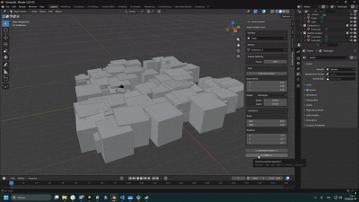

# Smart Scatter



## Описание

**Smart Scatter** — это аддон для Blender, предназначенный для процедурного размещения объектов на поверхности.

Аддон позволяет быстро распределять объекты из выбранной коллекции по поверхности с настройкой области генерации, количества объектов и случайной трансформации.

---

# Возможности

- Расстановка объектов по выбранной поверхности
- Использование коллекции объектов как источника ассетов
- Настройка количества создаваемых объектов
- Выбор области генерации
- Поддержка прямоугольной и круглой области
- Выбор центра области вручную
- Случайный масштаб объектов
- Случайное вращение объектов
- Очистка созданных объектов одной кнопкой

---

# Демонстрация



---

# Интерфейс



Структура интерфейса:

```
Smart Scatter

├── Surface
│   └── Object
│       ├── Object Picker
│       └── Eyedropper
│
├── Assets
│   └── Collection
│
├── Scatter Settings
│   └── Count
│
├── Area
│   ├── Pick Area Center
│   ├── Area Center
│   │   ├── X
│   │   ├── Y
│   │   └── Z
│   │
│   ├── Shape
│   │   ├── Rectangle
│   │   └── Circle
│   │
│   ├── Rectangle
│   │   ├── Width
│   │   └── Depth
│   │
│   └── Circle
│       └── Radius
│
├── Transform
│   ├── Scale
│   │   ├── Min
│   │   └── Max
│   │
│   └── Rotation
│       ├── X
│       ├── Y
│       └── Z
│
├── Generate Scatter
│
└── Clear
```

---

# Использование

1. Выберите поверхность, на которой будут размещены объекты.
2. Выберите коллекцию с объектами для рассеивания.
3. Настройте количество объектов.
4. Выберите форму и размер области генерации.
5. При необходимости настройте случайный масштаб и вращение.
6. Нажмите **Generate Scatter**.

После генерации объекты будут автоматически размещены на поверхности согласно выбранным параметрам.

---

# Примеры работы

## Rectangle Scatter




## Circle Scatter



## Pick area Scatter



## Random Transform



## Random Rotation



---

# Очистка

Кнопка **Clear** удаляет все объекты, созданные Smart Scatter, и очищает выходную коллекцию.



---

# Установка

1. Скачайте архив аддона.
2. Откройте Blender.
3. Перейдите:

```
Edit → Preferences → Add-ons → Install
```

4. Выберите ZIP-архив Smart Scatter.
5. Включите аддон.

---

# Требования

- Blender 4.x

---

# Планы развития

Возможные будущие улучшения:

- Фильтрация по наклону поверхности
- Поддержка Vertex Groups
- Настройка плотности распределения
- Более продвинутые правила размещения объектов

---

# Лицензия

MIT License
